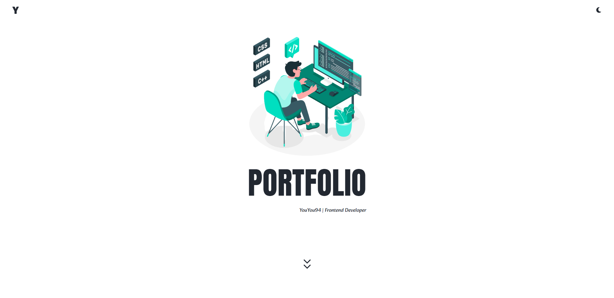

# Portfolio

`Typescript` + `React` + `Recoil` + `Styled-Components`를 이용하여 만든 포트폴리오입니다. 현재까지 사용했던 기술을 적용하고, 기능을 구현해보며 복습할 수 있었던 경험이 되었습니다.

※ **반응형 웹(1024px/768px/480px 기준)** 구현 
※ **23.07.04.** UI 변경

 
 

## 사용 기술

- Typescript | React | Recoil | Styled-Components

 

## 배포

- 주소 : http://YouYou94.github.io/portfolio

 

## UI

 

### 저작권 표시

- Intro 사진 : <a href="https://kr.freepik.com/free-vector/programming-concept-illustration_7118756.htm#query=frontend&position=23&from_view=keyword&track=sph#position=23&query=frontend">작가 storyset</a> 출처 Freepik
